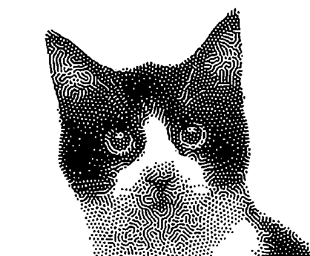
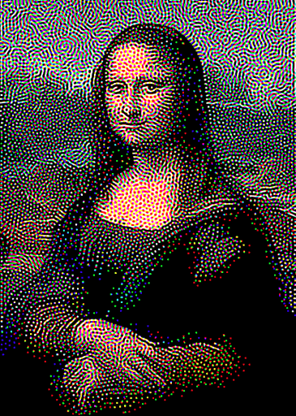
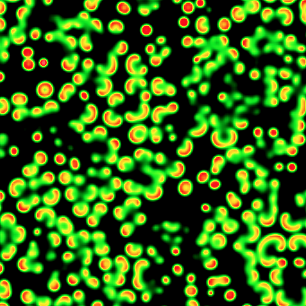
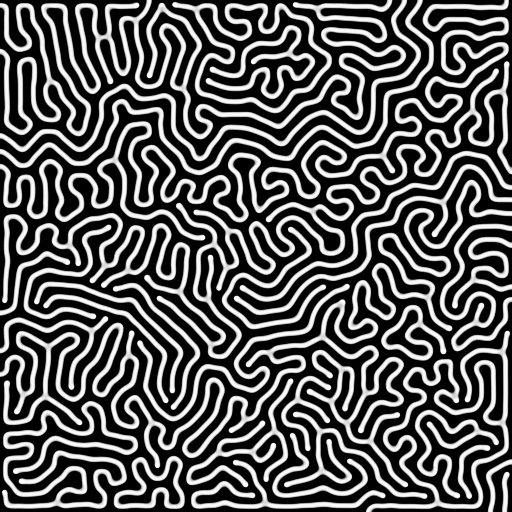
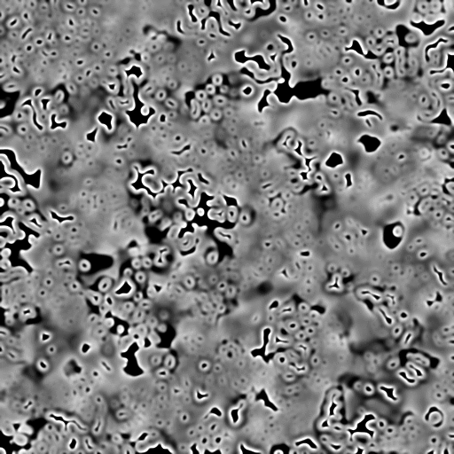
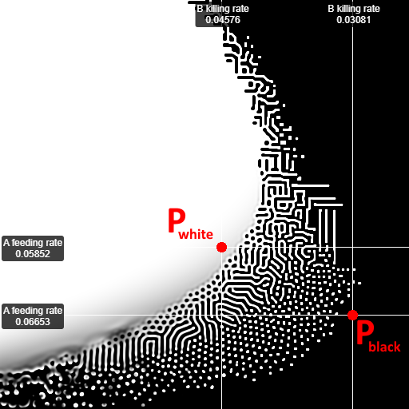
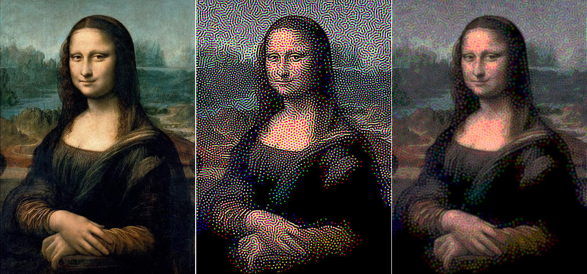
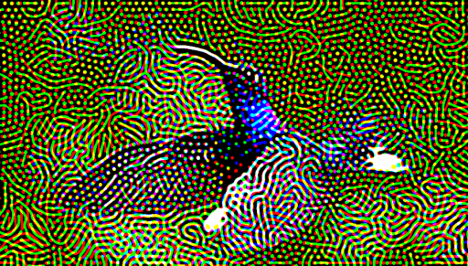
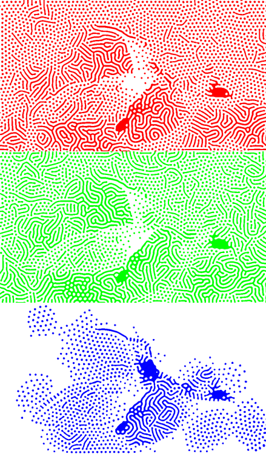

# reaction-diffusion
Reaction-diffusion is a model used to simulate the interaction of two chemical substances 'A' and 'B'. 'A' transforms into 'B' when it is in contact with it. Additionally, a little 'A' is continuously injected, and a fraction of 'B' slowly destroys itself.

This is a GPU implementation of the Gray Scott model. It exhibits natural-looking patterns, reminiscent of corals or some animal coats. Use the left mouse button to interact with the simulation.

See it live [here](https://piellardj.github.io/reaction-diffusion-webgl/?page%3Atabs%3Amap-tabs-id=uniform&page%3Aselect%3Apresets-fixed-select-id=0).

## Preview

https://user-images.githubusercontent.com/22922087/119693778-e5600800-be4c-11eb-978f-7387cfce0405.mp4

## Reaction-diffusion
### Model
Reaction-diffusion can be seen as a description of a simple chemical reaction between two substances 'A' and 'B'. I like to imagine they are liquid.

The rules are quite simple:
- a molecule of 'A' turns into 'B' if it meets two molecules of 'B': `A + 2B ⟶ 3B`
- more 'A' is continuously added (at a uniform feeding rate)
- a fraction of 'B' continuously disappears (at a uniform killing rate)
- 'A' and 'B' slowly diffuse at a constant rate.

This system can easily be discretized by turning it into a cellular automaton:
- space becomes an Eulerian grid where each cell has 2 scalars for the local concentration of 'A' and 'B'.
    - for each cell, the amount of 'A' that turns into 'B' is computed as `A x B x B`.
    - the feeding and killing rates can be uniform or vary from cell to cell.
    - the diffusion is a simple blur with a 3x3 kernel.
- in each iteration, the new state of the grid is computed from the previous one all at once.

### Implementation
The values for A and B are stored in a texture. Unfortunately, the default precision of 8 bits per channel is not enough for this simulation. A `RG16F` texture format would be ideal, however it is only available in WebGL 2. This is why I have to store each 16 bits value on 2x8 bits channels of a RGBA texture: the value for A is stored in red and green, and the value for B in blue and alpha.

## Image mode
In image mode, the feed and kill rates are not uniform, they vary locally based on the source image. They are interpolated between 2 presets, for white and black:

### Results
Using reaction-diffusion to approximate images is computationally expensive, but it gives results that are visually interesting. The output is quite trippy, but after blurring it a bit, you can see that is is pretty good. In this example, the hue is a bit off, but notice how many fine details are preserved.

    
    

        <i>Left: original image. Middle: approximation with reaction-diffusion. Right: blurred version of the middle image.</i>
    

### Black and white
For the black and white mode, the local brightness is sampled. I used the perceived brightness, computed as: `(0.21 × red) + (0.72 × green) + (0.07 × blue)`.

### Color
For the color mode, there are 3 simulations that run in parallel, one for each channel. They are combined at drawing time using additive compositing.

    
    

        <i>Here is a bird in color mode.</i>
    

    
    

        <i>Here the decomposition of the bird image.</i>
    

